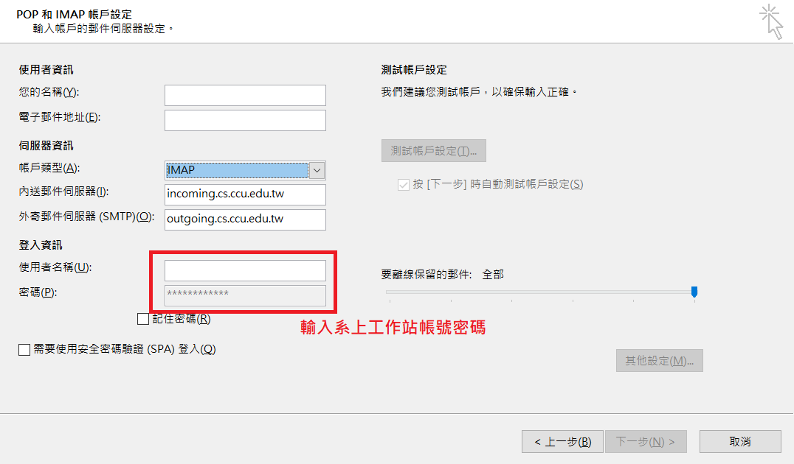
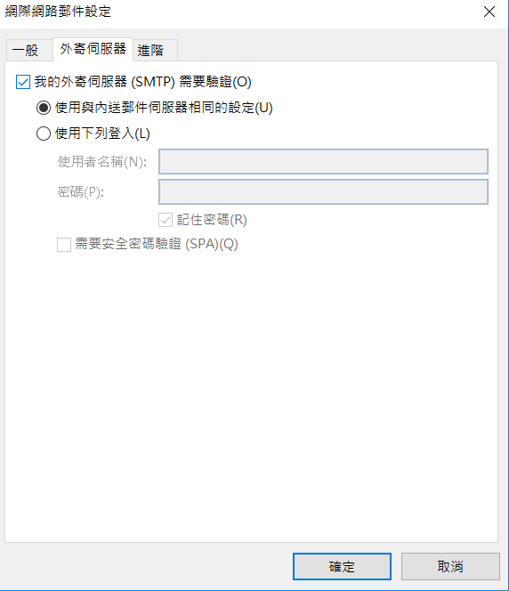

title: Mail 使用手冊
---

## 帳號

1. 教師
    + 由系辦主動通知機房建立帳號。
2. 本系在校生
    + 新生將統一由 SA 建立帳號，帳號密碼與工作站上的相同。

## 郵件伺服器設定
> 建議習慣將大量信件留存在 server 上的使用者使用 IMAP 服務，速度會比較快
> 本系 Email 服務 SMTP、POP3、IMAP 均需要以帳號密碼進行身份驗證。

### SMTP/POP3/IMAP 設定
+ SMTP: outgoing.cs.ccu.edu.tw (port 25, [outlook]使用 SMTP 認證並勾選 TLS/SSL, [thunderbird] 勾選 TLS)
+ POP3: incoming.cs.ccu.edu.tw (port 995, 勾選 SSL)
+ IMAP: incoming.cs.ccu.edu.tw (port 993, 勾選 SSL)

### Outlook 教學

以下教學以 Outlook 2016 進行示範

0. 執行 Outlook 後, 點選新增帳戶, 並選擇手動設定或其他伺服器類型選項

1. 選擇 POP3/IMAP

2. 根據前述之 SMTP/POP3/IMAP 進行伺服器設定( 以下以 IMAP 做示範 )

3. 輸入好個人相關帳號資訊後，點選 "其他設定" 欄位，切換到 "外寄郵件伺服器" 分頁, 勾選 "我的外寄郵件伺服器需要驗證"

4. 切換到 "進階" 選項分頁, 依據 POP3/IMAP 設定 SSL/TLS

5. 最後點選下一步進行 Outlook 自我測試，若設定皆無異常，應可以正常收發信件

## Web Mail 服務
目前系上提供 Roundcube & Rainloop 兩種 Webmail 服務。
- [Rainloop](https://csmail.cs.ccu.edu.tw/rainloop/)
- [Roundcube](https://csmail.cs.ccu.edu.tw/roundcube/)

## 常見問題

### Forward的設定
+ 不建議直接使用foward檔的設定, 建議使用pop3/imap收信, 若仍想設定可以使用 :
  1. 使用webmail的轉信設定
  2. 登入工作站後, 修改 ~/Maildir/.forward 而不是 ~/.forward

### Microsoft Outlook 突然出現無法收信的問題
+ 若使用 MS Office 內的 Microsoft Outlook 時發現無法收信，但使用其它郵件軟體可以收信或大部分的人都能正常收信時，請檢查看看各信件匣的信件數量是否過多，若過多時請將一定數量的信件刪除或進行封存，然後再試著收信看看。
+ 若不確定是否信件數量過多導致信件檔案過大，可以至 Outlook 的「工具」→「選項」→「郵件設定」→「資料檔案」中選擇您平常使用的郵件資料匣，若只有一個則預設是「個人資料匣」，點兩下後在彈出的視窗裡找到「檔案名稱」欄，檢查該路徑的檔案是否接近 2 GB，若是的話請清理您的信件。

### Microsoft Outlook 突然出現無法寄信的問題
+ 這個問題發生的原因同上，該問題也會導致無法寄信。
+ 提醒每任管理 mail server 的 SA：這種情況下 outlook 根本不會與 mail server 建立連線，所以 client 的 IP 完全不會出現在 maillog 中。

### 郵件軟體在接收郵件時發生逾時錯誤

+ 當保留在 POP3 server 上的郵件數量過多時，可能會因為傳送和處理的時間過長導致這個問題，這時請調大郵件軟體的逾時設定，
+ 以 outlook express 為例，在「工具 → 帳戶 → 郵件 → 點選一個帳號後選『內容』 → 進階 → 伺服器等候逾時」，將該處的拉桿向「長」的方向拉動即可增加等候的時間。
+ 請注意大部分郵件軟體的這個時間設定，會在開始收信時便倒數計時，當時間超過時無論是否還在傳送或處理郵件都會強制終止。
+ POP3 server 端的逾時設定為 900 秒，遠比大部分的 client 可設定的逾時上限還高。
