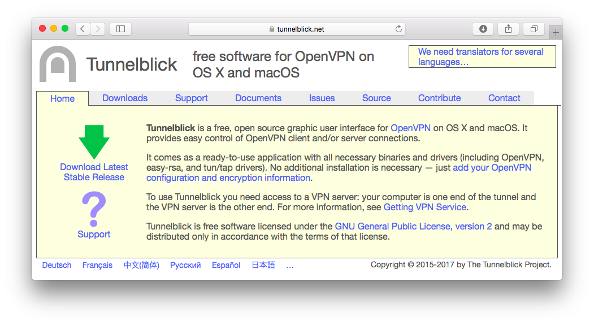
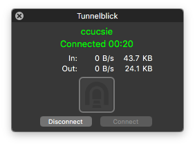

title: VPN 使用手冊
---

## PPTP
To be continue...


## OpenVPN

### Windows
0. 前往 [OpenVPN 官網下載處](https://openvpn.net/index.php/open-source/downloads.html)。 下載對應客戶端並安裝

1. 前往 [vpn.cs](https://vpn.cs.ccu.edu.tw)。下載 [OpenVPN 設定檔](https://vpn.cs.ccu.edu.tw/clients/ccucsie.ovpn)

2. 執行已安裝完成之 OpenVPN GUI

3. 點選GUI


### MacOS

本教學包含兩部分，請依喜好擇一選用。
* [Tunnelblick](#tunnelblick) ==for beginner==
* [Terminal](#terminal) ==for advanced user ~~and good CS student~~ :smiley:~==

#### Tunnelblick

0. 前往 [Tunnelblick 官網](https://tunnelblick.net)。 點擊左側綠色箭號 "Download Latest Stable Release"。


1. 當警示視窗跳出，點擊 "Open"。


2. 打開所下載之 dmg 檔案。雙擊 Tunnelblick 圖示。


3. 輸入 mac 使用者帳號及密碼以允許安裝。


4. 安裝完成後，將 [中正資工 VPN 設定檔](https://vpn.cs.ccu.edu.tw/clients/ccucsie.ovpn) 拖曳到左側 Configuration 欄內。


5. 點選上圖右下方之 "Connect"，或是點選 Spotlight 旁之 Tunnelblick 圖示（如下圖），並點選 "Connect ccucsie"。


6. 以中正資工系工作站帳號及密碼登入。


7. 看到訊息 "ccucsie Connected" 表示 VPN 連線已完成。


#### Terminal

0. 安裝套件管理工具 [Homebrew](https://brew.sh)。
Install package management tool [Homebrew](https://brew.sh).
```
$ /usr/bin/ruby -e "$(curl -fsSL https://raw.githubusercontent.com/Homebrew/install/master/install)"
```
> Q: What does homebrew do?
> A: Homebrew installs the stuff you need that Apple didn’t.[name=#homebrew][color=brown]

1. 以 Homebrew 安裝 OpenVPN。
```
$ brew install openvpn
```

2. 因 `openvpn` 置於 `/usr/local/sbin/` 下，而該路徑原生不在 `PATH` 中，故將下行加入 `~/.bashrc` 中，並重新 `source ~/.bashrc`。
```
export PATH=/usr/local/sbin:$PATH
```

3. 以 `openvpn` 進行連線。（[OpenVPN 設定檔下載](https://vpn.cs.ccu.edu.tw/clients/ccucsie.ovpn)）
```
$ sudo openvpn /path/to/config/ccucsie.ovpn
```


4. 看到訊息 "Initialization Sequence Completed" 表示 VPN 連線已完成。
```
Sun Nov 12 11:17:53 2017 Initialization Sequence Completed
```

5. （選擇性）因密碼可能會快取於記憶體中，請考慮使用參數 `auth-nocache` 以提升安全性。
```
WARNING: this configuration may cache passwords in memory -- use the auth-nocache option to prevent this
```


## Bug Report

若使用上有問題，請聯繫資工系計中信箱。
- [About US](/about/)

<i class="fa fa-edit fa-fw"></i> Last Edited: _2018/07/08 by setsal_, contributed by _silenttulips_
